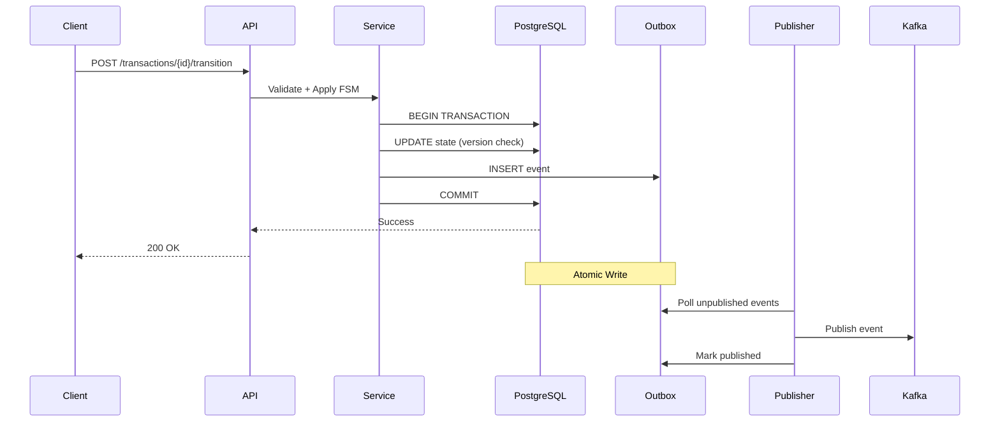

# Transaction Engine

Transactional workflow engine designed to prevent state corruption in payment and finance systems.

Built to enforce exactly-once state transitions under concurrency.

Companion system: [async-rag-ingestion-engine](https://github.com/winsongr/async-rag-ingestion-engine)

---

## Why This Exists

Payment systems fail when state becomes ambiguous. This engine eliminates that failure mode.

**Guarantees:**
- States are FSM-validated (no arbitrary transitions)
- State changes are exactly-once (optimistic locking)
- Events are reliably published (transactional outbox)
- History is immutable (append-only audit log)

Built for correctness over convenience.

---

## Core Responsibility

**Handles:**
- Strict state transitions via Finite State Machine
- Exactly-once state changes (DB transaction + version check)
- Reliable Kafka publishing (transactional outbox pattern)
- Full audit trail (immutable records)

**Does NOT handle:**
- Document ingestion (different failure mode)
- Vector storage (wrong bounded context)
- Retry-heavy pipelines (isolated to ingestion layer)

Separation prevents failure modes from bleeding across systems.

---

## Architecture


**Key invariant:** State change and outbox write happen in one atomic transaction.

---

## Design Decisions

### 1. Finite State Machine (FSM)

States cannot be set arbitrarily. Each transition is explicitly allowed or rejected.
```python
ALLOWED_TRANSITIONS = {
    "CREATED": ["PENDING"],
    "PENDING": ["COMPLETED", "FAILED"],
    "COMPLETED": [],  # Terminal state
    "FAILED": ["PENDING"],  # Allow retry
}
```

**Examples:**
- `CREATED → PENDING` ✅
- `PENDING → COMPLETED` ✅  
- `FAILED → COMPLETED` ❌ (Illegal - fails loudly)

Invalid transitions fail fast, preventing silent corruption.

---

### 2. Transactional Outbox Pattern

Publishing directly to Kafka from request handlers is unsafe (dual-write problem: DB succeeds, Kafka fails → inconsistency).

**Our approach:**
1. Begin DB transaction
2. Apply state change
3. Insert event to `outbox` table
4. Commit transaction
5. Background worker publishes to Kafka

**Result:** No lost events, no phantom events. DB and Kafka stay consistent.

---

### 3. Optimistic Locking

Concurrent updates use version checks:
```sql
UPDATE transactions 
SET state = 'COMPLETED', version = version + 1
WHERE id = '...' AND version = 5
```

**Under contention:**
- First request succeeds (version match)
- Second request fails (version mismatch → 409 Conflict)

Enforces single-winner semantics without heavyweight locks.

---

### 4. Idempotency

All state-changing operations require `X-Idempotency-Key` header.

**On retry:**
- Same key → same outcome (no duplicate state change)
- Same key → same event (no duplicate Kafka message)
- Safe to retry unconditionally

Prevents double-settlement in payment workflows.

---

### 5. Append-Only Audit

State records are immutable:
- No `UPDATE` statements on historical data
- Every change is timestamped
- Full replay capability for forensics

Enables compliance audits and deterministic debugging.

---

## Failure Handling

| Scenario | Behavior | Outcome |
|----------|----------|---------|
| API retry | Idempotency key prevents duplication | Safe |
| Service crash | DB transaction rolls back | No partial state |
| Kafka down | Events remain in outbox | Eventual publish |
| Concurrent updates | Optimistic lock rejects one | No corruption |
| Duplicate Kafka messages | Consumers use `event_id` to deduplicate | Safe |

**Zero undefined states.**

---

## Kafka Publishing Config
```python
{
    "acks": "all",  # Wait for all replicas
    "enable.idempotence": True,  # Prevent duplicates
    "key": aggregate_id,  # Per-transaction ordering
}
```

**Trade-off:** Duplicate Kafka messages are acceptable. Duplicate state changes are impossible.

---

## Correctness Validation

### Safety Benchmark (Adversarial Test)

Simulates 50 concurrent requests trying to modify the same transaction:
```bash
python scripts/benchmark_state_safety.py
```

**Result:**
```
🚀 Starting Safety Benchmark: 50 concurrent requests...
🎯 Target: Single Wallet (wallet_8f3a...)

📊 Results:
✅ Successful Transitions: 1
🛡️ Blocked Conflicts (409): 49
❌ Other Errors: 0

✅ PASSED: Perfect safety. No double-spends detected.
```

Proves optimistic locking works under contention.

---

## System Separation Rationale

| Concern | Ingestion Engine | Transaction Engine |
|---------|-----------------|-------------------|
| Failure mode | Partial/bad data | State corruption |
| Retry strategy | Automatic | Explicit (idempotent) |
| Consistency | At-least-once | Exactly-once (state) |
| Optimization | Throughput | Correctness |
| Scaling constraint | I/O bound | Validation/lock bound |

This split isolates failure domains and simplifies reasoning about edge cases.

---

## Intentionally Out of Scope

- AI inference (wrong layer)
- Vector databases (different bounded context)
- Authentication (orthogonal concern)
- UI/dashboards (API-first design)
- Distributed sagas (not needed for single-DB transactions)
- "Exactly-once delivery" (theoretically impossible)

---

## Running Locally
```bash
# Start infrastructure (Postgres, Redpanda, Redis)
docker compose up -d

# Run migrations
alembic upgrade head

# Start API
uvicorn src.main:app --reload

# Start outbox publisher (separate terminal)
python src/cmd/outbox_publisher.py
```

---

## Key Files for Review

Start here to understand correctness guarantees:

1. **FSM rules:** `src/domain/fsm.py`
2. **Optimistic locking:** `src/adapters/repository.py`
3. **Outbox flow:** `src/adapters/outbox.py`
4. **Safety benchmark:** `scripts/benchmark_state_safety.py`

---

## Core Principle

> State correctness is a design problem, not a retry problem.

This system makes invalid states unrepresentable.
```

---

## ~~~ FINANCIAL-TRANSACTIONS-DASHBOARD ~~~

### GitHub Description (one-liner):
```
Full-stack financial analytics platform demonstrating CSV ingestion, async aggregation, and transaction visualization
```

### Topics:
```
fastapi react postgresql sqlalchemy analytics dashboard csv-processing fintech data-pipeline docker typescript
