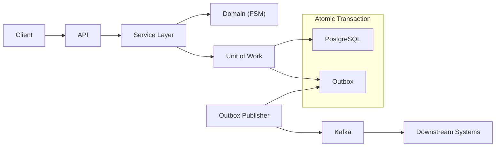

# Transaction Engine

**Part 2 of the Sentinel System - Deterministic Workflow & State Integrity**

This repository implements a transactional workflow engine focused on state correctness under concurrency.

It is intentionally narrow in scope and optimized for **correctness, auditability, and determinism**, not feature breadth.

This service complements the ingestion pipeline handled by the companion service:
**[async-rag-ingestion-engine](https://github.com/winsongr/async-rag-ingestion-engine)**

---

## ⚡ Why This Exists

Backend systems fail for different reasons:

- **Ingestion systems** fail due to bad, partial, or duplicated data.
- **Transaction systems** fail due to corrupted or ambiguous state.

This service addresses the second problem.

Once a workflow step is committed here, its state is guaranteed to be:

- **Valid** (FSM enforced)
- **Auditable** (Append-only history)
- **Replay-safe** (Idempotent)
- **Externally observable** (via Kafka)

This system is built for **correctness over convenience**.

---

## 🎯 Core Responsibility

This service guarantees:

- **Strict state transitions** enforced by a Finite State Machine (FSM).
- **Exactly-once state changes** via database transactions and optimistic locking.
- **Reliable event emission** using the Transactional Outbox pattern.
- **Full auditability** through immutable records.

It explicitly **does not** handle:

- Document ingestion
- Embeddings or vector storage
- AI inference
- Retry-heavy pipelines

Those concerns have different failure modes and are isolated by design.

---

## 🏗 Architecture

Workflows are modeled as state machines, not mutable status flags.

- Input validation occurs at the API boundary.
- Business correctness is enforced in the domain layer.



**Key Invariant:**
State change and outbox write occur in **one atomic database transaction**.
PostgreSQL is the system of record. Kafka is used strictly for integration.

---

## 🧠 Design Decisions

### 1. Finite State Machine (FSM)

States cannot be set arbitrarily. Each transition is explicitly allowed or rejected.

- `CREATED → PENDING` ✅
- `PENDING → COMPLETED` ✅
- `FAILED → COMPLETED` ❌ (Illegal)

Invalid transitions fail fast and loudly, preventing silent corruption.

### 2. Transactional Outbox Pattern

Publishing directly to Kafka inside request handlers is unsafe (the "Dual-Write Problem").

**Our Solution:**

1. Begin database transaction.
2. Apply state change.
3. Insert event into `outbox` table.
4. Commit transaction.
5. Background worker publishes events to Kafka.

**Result:** No lost events. No phantom events. Database and Kafka remain consistent.

### 3. Optimistic Locking

Concurrent updates are controlled using version checks at the database level.
If two requests attempt to mutate the same transaction concurrently:

- One succeeds.
- One is rejected (409 Conflict).

This enforces **single-winner semantics** under contention.

### 4. Idempotency

All externally triggered operations require an `X-Idempotency-Key` header.
If the same request is retried:

- State is not duplicated.
- Events are not re-emitted.
- No double-settlement occurs.

Retries are safe by construction.

### 5. Append-Only Audit Model

State-changing records are immutable:

- No destructive updates.
- No overwrites.
- Every change is timestamped.

This enables audits, deterministic replays, and forensic debugging.

---

## 💥 Failure Handling

Failure is assumed, not exceptional.

| Scenario               | Behavior                              | Outcome          |
| ---------------------- | ------------------------------------- | ---------------- |
| **API Retry**          | Idempotency prevents duplication      | Safe             |
| **Service Crash**      | Transaction rolls back                | No partial state |
| **Kafka Unavailable**  | Events remain in outbox               | No data loss     |
| **Partial Execution**  | No committed state                    | Atomic guarantee |
| **Duplicate Messages** | Safely ignored (Idempotent consumers) | Safe             |

There are no undefined states.

---

## 📡 Kafka Publishing Guarantees

The outbox publisher is configured for safety:

| Setting              | Value          | Why                                 |
| -------------------- | -------------- | ----------------------------------- |
| `acks`               | `all`          | Wait for all replicas               |
| `enable_idempotence` | `true`         | Prevent duplicate messages on retry |
| `key`                | `aggregate_id` | Guaranteed ordering per transaction |

- Duplicate Kafka messages are acceptable.
- Duplicate state changes are impossible.
- Consumers deduplicate using `event_id`.

---

## 🛡 Validation

Correctness is verified via **adversarial testing**.
A safety benchmark simulates high contention by firing **50 concurrent state transitions** against the same transaction.

**Run the test:**

```bash
python scripts/benchmark_state_safety.py

```

**Observed Result:**

```text
🚀 Starting Safety Benchmark: 50 concurrent requests...
🎯 Target: Single Wallet (wallet_8f3a...)

📊 Results:
✅ Successful Transactions (201): 1
🛡️ Blocked Conflicts (409):      49
❌ Other Errors:                 0

✅ PASSED: Perfect safety. No double spends detected.

```

This proves correctness under concurrency and validates optimistic locking behavior.

---

## 🧩 Why This Is a Separate Service

The Sentinel system is split intentionally.

| Concern            | Ingestion Engine    | Transaction Engine      |
| ------------------ | ------------------- | ----------------------- |
| **Failure Mode**   | Bad / partial data  | Corrupted state         |
| **Retry Strategy** | Automatic           | Explicit, idempotent    |
| **Consistency**    | At-least-once       | Exactly-once (State)    |
| **Optimization**   | Throughput          | Correctness             |
| **Scaling**        | I/O-bound (Vectors) | Lock / Validation bound |

This separation isolates failure and simplifies reasoning. It is **failure isolation**, not over-engineering.

---

## ❌ Out of Scope (Intentional)

- AI inference
- Document parsing
- Vector databases
- Authentication / User Management
- UI or Dashboards
- Sagas / Distributed transactions
- "Exactly-once delivery" claims (impossible)

Those belong in other bounded contexts.

---

## 🚀 Running the System

```bash
# 1. Start infrastructure (Postgres, Redpanda, Redis)
docker compose up -d

# 2. Apply database migrations
alembic upgrade head

# 3. Start API
uvicorn src.main:app --reload

# 4. Start Outbox Publisher (in new terminal)
python src/cmd/outbox_publisher.py

```

---

## 📝 Final Note

This repository exists to demonstrate one principle:

> **State correctness is a design problem, not a retry problem.**

If you are reviewing this code, start with:

1. The **FSM rules** (`src/domain/fsm.py`)
2. The **Optimistic Locking logic** (`src/adapters/repository.py`)
3. The **Outbox flow** (`src/adapters/outbox.py`)

That is where correctness lives.
